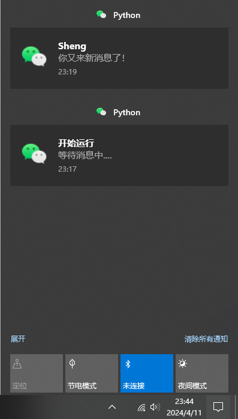

# 📣WechatMsgToast

------

适用于PC平台的**微信消息弹出通知**

🎉仅供娱乐 🎉

## 📷截图

------

##  🛠️具体功能

------

持续检测未读消息并推送到通知中心

运行程序之前，请打开微信聊天窗口

## 🔍原理

------

需要打开系统中的通知中心和发送通知（理论支持Linux和mac）

程序的实现非常简单粗暴（有一些bug...能用是能用）

使用**uiautomation**根据窗口控件来获取未读消息，

用plyer库中**Notification**的发送通知

